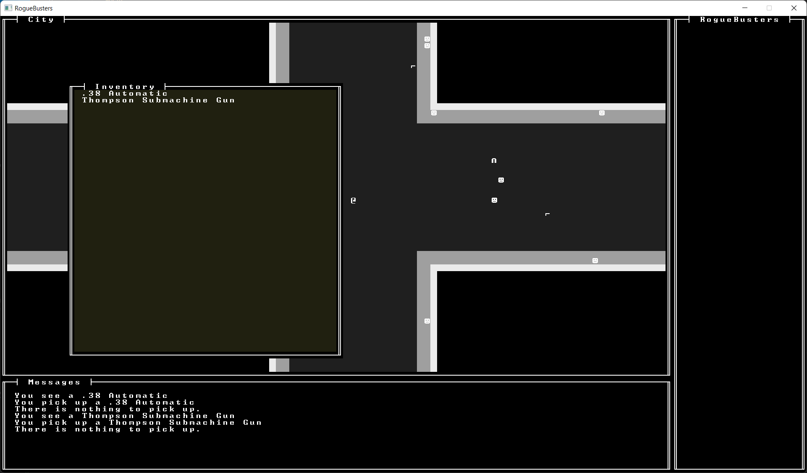

RogueBusters
============

RogueBusters is a roguelike game developed in Rust, utilizing the `libtcod` library for terminal rendering and the `specs` library for the entity-component-system (ECS) architecture. Dive into a procedurally generated city set in the prohibition-era United States during the 1920s.



Features
--------

* Procedurally generated city with varied building layouts and businesses
* Turn-based combat system
* A diverse set of NPCs with unique abilities
* An extensive range of items and weapons
* Character progression and skill system
* ASCII graphics rendered using libtcod
* Efficient and modular ECS architecture with specs
* Cars!

Installation
------------

### Prerequisites

* [Rust](https://www.rust-lang.org/tools/install) installed on your system (1.56.0 or higher)
* [libtcod](https://github.com/libtcod/libtcod) library

### Building and Running

```
git clone https://github.com/newcarrotgames/RogueBusters.git
cd RogueBusters
cargo run --release
```

Controls
--------

* Movement: Numpad
* Attack: Move into an NPC
* Pick up item: `p` when standing on an item
* Open inventory: `i`
* Drop item: `d` followed by the item's inventory index
* View character sheet: `c`
* Quit game: `Q`

Contributing
------------

Contributions are welcome! Please follow these steps:

1.  Fork the repository
2.  Create a new branch for your feature or bugfix
3.  Commit your changes to the new branch
4.  Create a pull request, describing your changes and any potential issues

We will review your pull request as soon as possible. Thank you for your contribution!