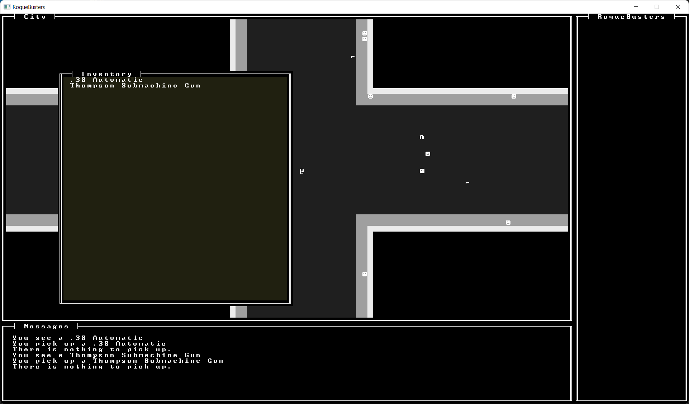

RogueBusters
============

A turn-based roguelike set in the prohibition-era United States, 1920s.

Built in Rust using [bracket-lib](https://github.com/amethyst/bracket-lib) for
rendering and [specs](https://github.com/amethyst/specs) for the
Entity-Component-System architecture.



---


Installation
------------

### Prerequisites

- [Rust](https://www.rust-lang.org/tools/install) 1.70 or newer

### Build and Run

```
git clone https://github.com/newcarrotgames/RogueBusters.git
cd RogueBusters
cargo run --release
```

No external native libraries required. The window is resizable by default.

Controls
--------

| Key | Action |
|-----|--------|
| Numpad / Arrow keys | Move / attack (bump into NPC) |
| `P` | Pick up item at current tile |
| `W` | Wield item at current tile |
| `D` | Drop wielded item |
| `.` | Wait one turn |
| `S` | Crosshairs mode (click to target) |
| `I` | Open inventory |
| `M` | Open map |
| `H` | Help |
| `Shift+Q` | Quit |

Architecture
------------

```
src/
  components/   Pure ECS data (Position, Attributes, Inventory, NPC, …)
  systems/      Pure ECS behavior (PlayerAction, NPCBehavior, Combat, …)
  city/         Procedural map and building generation
  deser/        XML data loading — items, prefabs, generators
  ui/           Rendering layer (elements/, modals/)
  input/        Keyboard handling and input handler trait
  service/      ScreenService — dynamic layout dimensions
  util/         Shared utilities (RNG)
  testing/      Headless play-testing harness (cfg(test) only)
```

The simulation runs through a `specs` `Dispatcher`; bracket-lib drives the main loop.
Systems with non-overlapping `SystemData` are ready for parallel dispatch via rayon
when that becomes necessary.

The game uses a vendored, lightly patched copy of `bracket-terminal` (in
`vendor/bracket-terminal/`) to enable free window resizing without aspect-ratio
letterboxing.

Data files
----------

Game content is defined in XML and loaded at startup:

| Path | Contents |
|------|----------|
| `data/items/weapons.items.xml` | All weapons with stats |
| `data/items/clothing.items.xml` | All clothing items |
| `data/prefabs/*.prefab.xml` | ASCII room furniture pieces |
| `data/generators/*.generator.xml` | Rules for filling building interiors |

Roadmap
-------

- [ ] Smarter NPCs — patrol, search, and flee when hurt
- [ ] Varied building interiors — speakeasies, shops, apartments, offices
- [ ] Dialog System
- [ ] Shops
- [ ] Character progression (xp, skills, leveling)
- [ ] Cars!
